<h2 align="left">Hi 👋! My name is Ana Paula and I'm a Data Analyst, from Brazil.</h2>

###

Olá, eu me chamo Ana Paula e sou uma Analista de Dados brasileira.  Se você tem interesse em tomar decisões orientadas por dados reais, você chegou ao perfil certo! Fique a vontade para dar uma olhada nos meus projetos navegando pelos repositórios.

## 📊 Meus GitHub Stats

###

  

###

###

  
  
  
  
  
  
  

###

  

###

###
